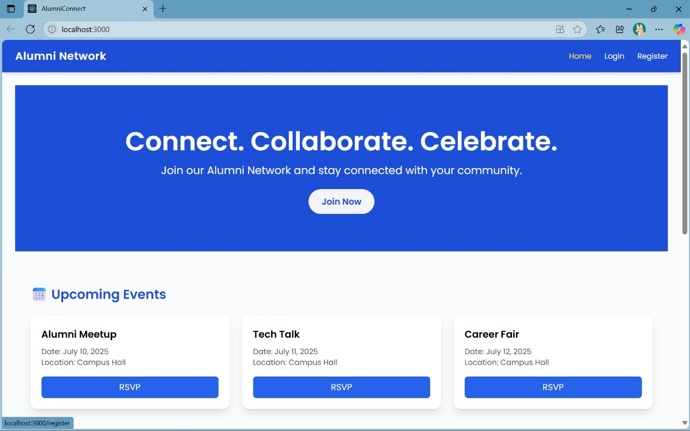
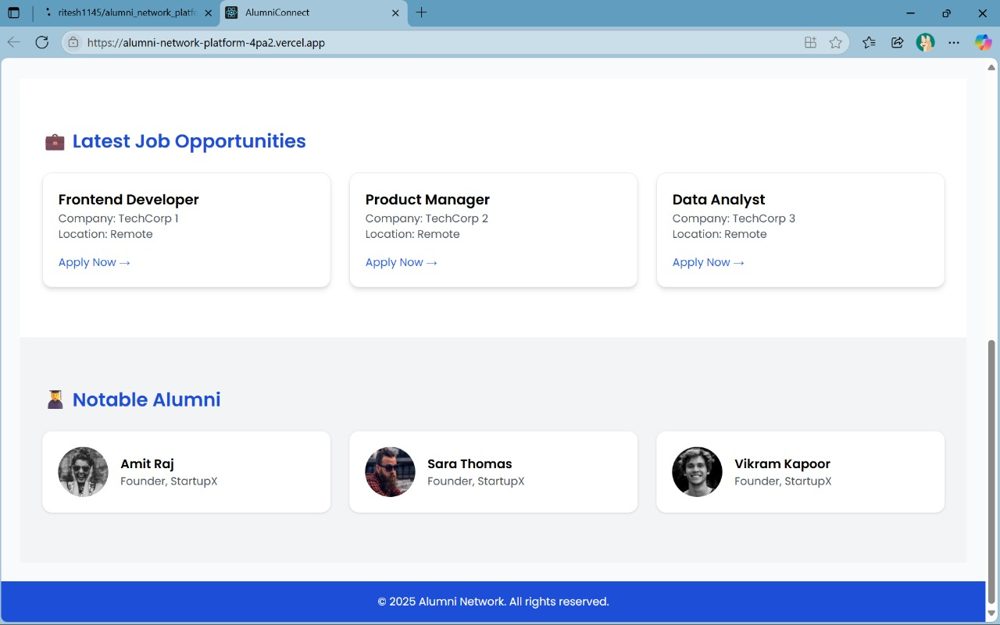
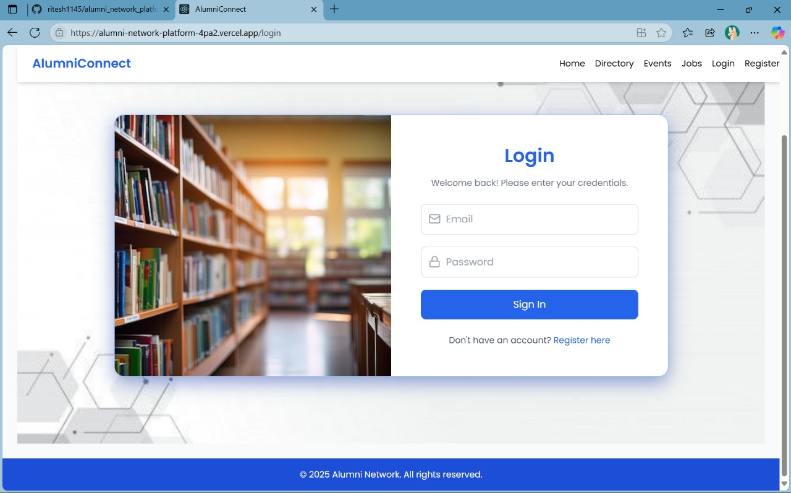
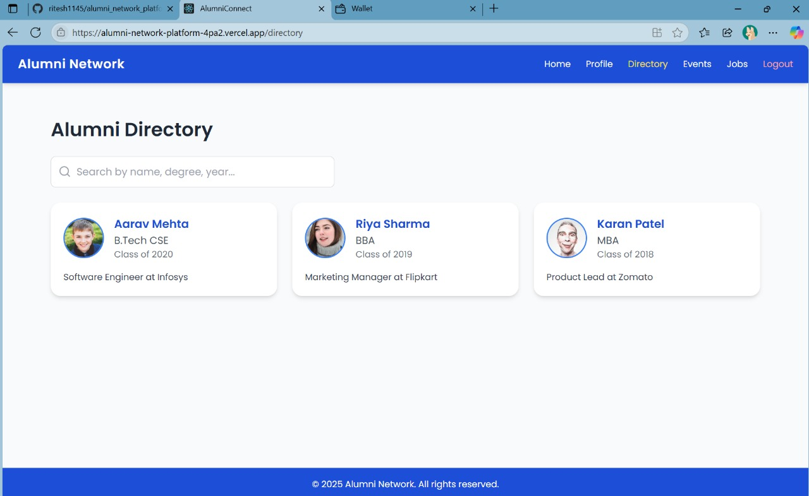
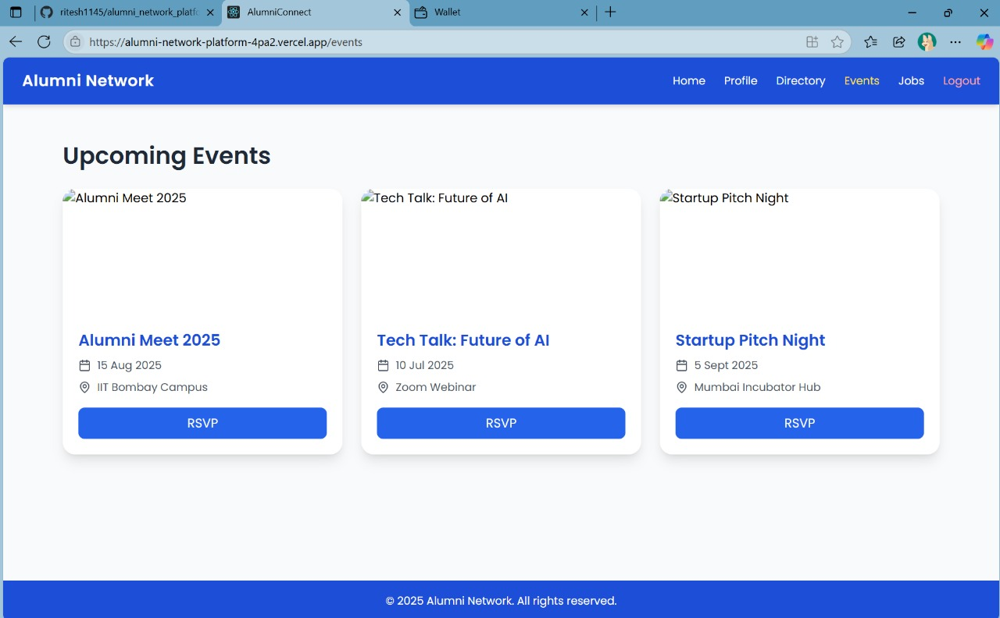
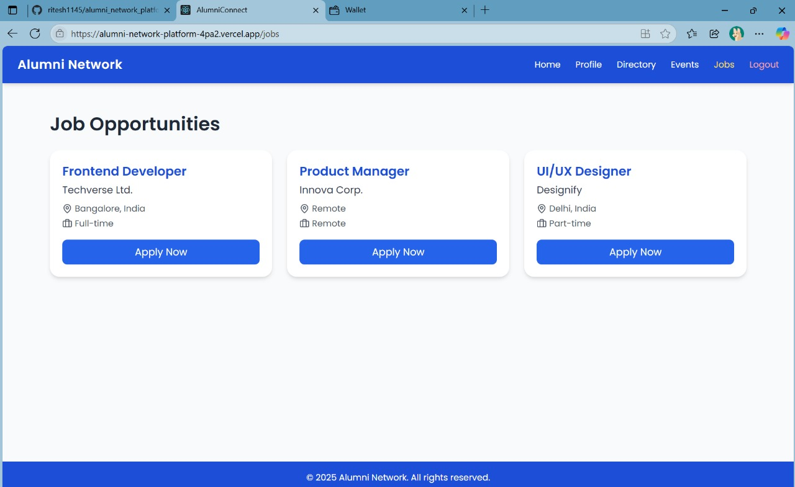
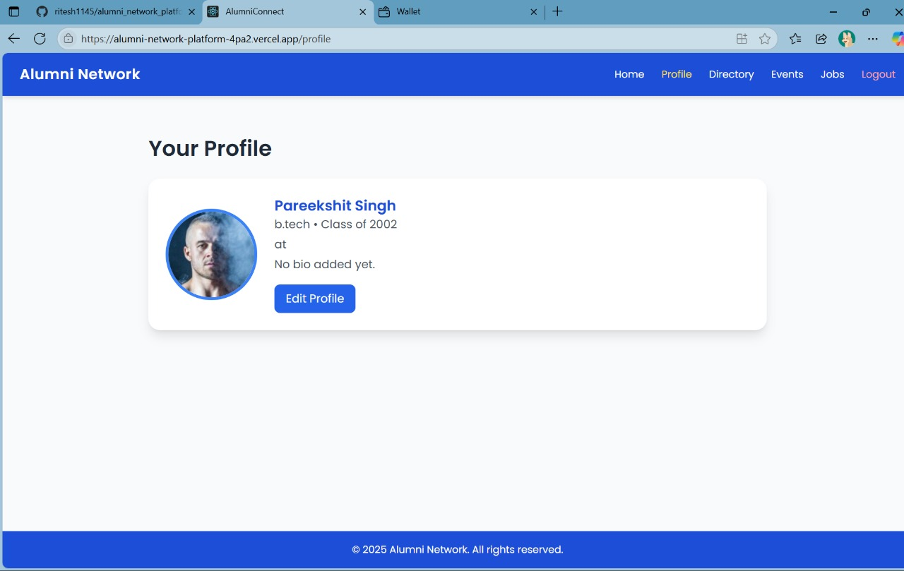

# 🎓✨ Alumni Network Platform

> Connect. Inspire. Grow.  
> A modern platform designed to unite alumni, foster lifelong connections, and open doors to new opportunities.

---

## 🌟 Why this project?

As alumni move into the world, connections fade — but the value of a strong network never does. This platform is built to help alumni stay in touch, share experiences, and support each other's journeys beyond graduation.

---

## 💡 What can you do?

🎯 **Create your profile**  
Showcase your degree, graduation year, and career highlights.

🤝 **Connect with alumni**  
Browse a directory of graduates from different years and departments.

🎉 **Stay updated on events**  
Join reunions, workshops, or networking meetups organized by the community.

💼 **Explore job opportunities**  
Find or post career openings to help fellow alumni succeed.

🛡️ **Admin powers**  
Moderate the network by managing users, events, and jobs safely and efficiently.

---

## ✨ Highlights

- 🔒 **Secure login & registration** (JWT-based)
- 🏷️ **Personalized alumni profiles**
- 🗂️ **Dynamic alumni directory**
- 📅 **Event board & announcements**
- 💼 **Job portal for alumni opportunities**
- ⚙️ **Admin control panel for moderation**
- 💬 **Beautiful, responsive, and user-friendly UI**

---

## 🖼️ Sneak Peek

### 📌 Landing Page

### ❓ In Action

### ❓ Database

---

## ⚙️ Technology behind the scenes

Built with love using:

- **Frontend:** React.js, Tailwind CSS
- **Backend:** Node.js, Express.js
- **Database:** MySQL (via Sequelize)
- **Authentication:** JWT

---

## 🚀 Quick start

### 🌱 Clone & install

First Clone the project..

### 🔧 Backend setup

cd server
npm install
npm start

### 💻 Frontend setup

cd ../client
npm install
npm start

---

## 💬 The story behind

🌟 This project was born from the idea that alumni networks should be more than just a list of names.
They should be living, breathing communities where we help each other grow — personally and professionally.

---

## 🛠️ Roadmap & dreams

- 📸 Profile pictures & social links
- 📬 Email invitations & verification
- 🔔 Real-time notifications
- 💬 In-platform messaging or chat
- 📊 Analytics dashboard for admins
